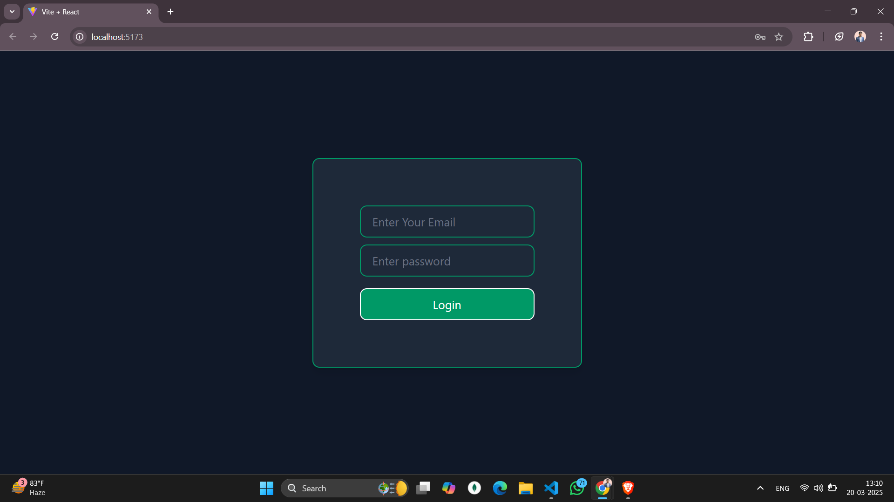
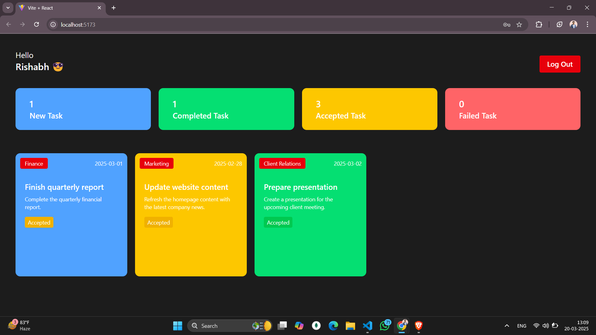

# Employee Management System

## Overview
The **Employee Management System (e.m.system)** is a web-based platform designed to streamline task management within an organization. It features two separate dashboards:
1. **Admin Dashboard**: Allows administrators to assign tasks to employees and track their progress.
2. **Employee Dashboard**: Enables employees to update the status of their assigned tasks.

The application leverages modern technologies such as **React**, **TailwindCSS**, and **Vite** to deliver a user-friendly and efficient interface.

---

## Features
- **Admin Dashboard**:
  - Create, assign, and manage tasks for employees.
  - Monitor task status updates provided by employees.
- **Employee Dashboard**:
  - View assigned tasks and their details.
  - Update the status of tasks (e.g., Pending, In Progress, Completed).

---

## Project Structure
### Technologies Used:
- **React** for building the user interface.
- **TailwindCSS** for styling and responsive design.
- **Vite** as the build tool for a faster development experience.

### Dependencies:
- `@tailwindcss/vite`: Integration of TailwindCSS with Vite.
- `react` and `react-dom`: Core libraries for React application development.
- `tailwindcss`: CSS framework for modern styling.

### Development Tools:
- `eslint`: Ensures code quality and consistency.
- `vite`: Powers development and build processes.

---
